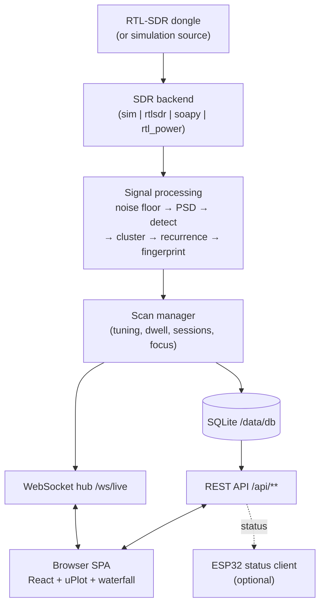

# rtl-sdr-channel-detector

A **receive-only** RTL-SDR spectrum monitoring app. It captures a slice of RF
spectrum, tracks the noise floor, detects occupied regions, groups them into
**candidate channels**, and streams the live spectrum, a waterfall, and detection
data to your browser in real time. It ships with a **simulation mode** so you can
run the whole thing with **no hardware**.

> **RECEIVE-ONLY.** This project only *listens*. It cannot and does not transmit,
> replay, jam, spoof, manipulate meters, or bypass any authentication. See
> [What it does NOT do](#2-what-it-does-not-do).

## Quickstart

```bash
cp .env.example .env
docker compose up --build
# open the UI:
#   http://localhost:8080
```

That's it — the default `.env` sets `SIMULATION_MODE=true`, so it runs without a
dongle. To use real hardware, see [Linux USB setup](#4-linux-usb-setup) and set
`SDR_BACKEND=rtlsdr` + `SIMULATION_MODE=false` in `.env`.

## Architecture



More detail in [docs/architecture.md](docs/architecture.md).

---

## 1. What it does

- Tunes an RTL-SDR (or a synthetic source) across a configurable frequency span
  (default ~867–870 MHz) and computes a live power spectrum.
- Estimates a rolling **noise floor** and flags spectrum that rises above it.
- Groups contiguous over-threshold bins into regions, merges fragments, and
  **clusters** recurring regions into persistent **candidate channels** with
  power, SNR, bandwidth, burst timing, recurrence interval, and a confidence
  score.
- Streams a live spectrum line + **waterfall** and a candidate-channel table to
  the browser over WebSocket; records an **event timeline** and **sessions**.
- Lets one operator hold a **control lease** to change scan settings and
  start/stop scans while others watch read-only.
- Optionally records short **IQ** captures and exports data as CSV/JSON.
- Optionally drives a small **ESP32** status display.

## 2. What it does NOT do

This tool is strictly **receive-only** and passive. It does **not**:

- **Transmit** anything, on any frequency, ever.
- **Replay** captured signals.
- **Jam** or interfere with any device or band.
- **Spoof** or impersonate any device or transmitter.
- **Manipulate meters** (utility/smart meters) or any device state.
- **Bypass authentication**, decrypt, or defeat any security mechanism.
- Demodulate/decode arbitrary payloads — unknown payloads are treated as
  **opaque** RF footprints only (see
  [docs/signal-detection.md](docs/signal-detection.md)).

You are responsible for using it lawfully — see
[Security & privacy](#16-security--privacy-notes).

## 3. Hardware requirements

- An **RTL-SDR** USB dongle (RTL2832U, e.g. RTL-SDR Blog v3/v4, or a generic
  R820T2/R860). Receive-only.
- A Linux host for real-hardware capture (USB passthrough into Docker works on
  Linux; **not** on Docker Desktop for macOS/Windows).
- A suitable antenna for your target band (e.g. 868 MHz).
- **None of the above** is required for simulation mode — any machine that runs
  Docker will do.
- (Optional) an **ESP32** dev board for the status display.

## 4. Linux USB setup

Only needed for real hardware. Summary (full guide:
[docs/usb-passthrough.md](docs/usb-passthrough.md)):

1. Find the dongle: `lsusb | grep -Ei 'Realtek|RTL2838|0bda:2838'`.
2. Blacklist the kernel DVB driver that otherwise claims it:
   ```bash
   printf 'blacklist dvb_usb_rtl28xxu\nblacklist rtl2832\nblacklist rtl2830\n' \
     | sudo tee /etc/modprobe.d/blacklist-rtl.conf
   sudo modprobe -r dvb_usb_rtl28xxu 2>/dev/null || true
   ```
3. Add a udev rule for non-root access:
   ```bash
   echo 'SUBSYSTEM=="usb", ATTRS{idVendor}=="0bda", ATTRS{idProduct}=="2838", MODE="0666"' \
     | sudo tee /etc/udev/rules.d/99-rtl-sdr.rules
   sudo udevadm control --reload-rules && sudo udevadm trigger
   ```
4. Re-plug, then verify: `rtl_test -t`.

The provided `docker-compose.yml` passes USB through **without privileged mode**
using `/dev/bus/usb` + `device_cgroup_rules: c 189:* rmw`.

## 5. Docker startup

```bash
cp .env.example .env          # first time only
docker compose up --build     # foreground; Ctrl-C to stop
# or, detached:
docker compose up -d --build
docker compose logs -f
docker compose down
```

Convenience wrappers (see `make help`):

```bash
make bootstrap   # create data dirs, .env, probe for a dongle
make up          # start detached + print URL
make logs        # follow logs
make down        # stop
```

UI: **http://localhost:8080** (override with `WEB_PORT` in `.env`).

## 6. Simulation mode

The default. With `SIMULATION_MODE=true` (or `SDR_BACKEND=sim`) the backend
generates a synthetic spectrum — noise floor plus a few recurring emitters —
so the entire pipeline, UI, detection, recording metadata and exports work with
no dongle attached. Great for development, demos, and isolating hardware issues.

To switch to real hardware, set in `.env`:

```ini
SIMULATION_MODE=false
SDR_BACKEND=rtlsdr        # or soapy / rtl_power
```

If no device is found at runtime, the app falls back to simulation rather than
crashing.

## 7. Configure a scan (~867–870 MHz)

Set the span in `.env` (Hz, integers) — this is the default:

```ini
SCAN_START_HZ=867000000     # 867.000 MHz
SCAN_END_HZ=870000000       # 870.000 MHz
SCAN_STEP_HZ=0              # 0 = auto (from sample rate)
SCAN_DWELL_MS=120           # time per tuning step
SDR_SAMPLE_RATE=2400000     # 2.4 MS/s
DETECTION_THRESHOLD_DB=6.0  # dB above noise floor to count as "occupied"
NOISE_FLOOR_ALPHA=0.05      # noise-floor EMA smoothing
```

Or change it live in the UI **Settings** page (requires the control lease) — via
`PUT /api/config`. Start/stop with the UI or `POST /api/scan/start` /
`POST /api/scan/stop`. Exclude sub-ranges with `exclusions` in the config.

### Wavenis 868 wideband profile

The Settings page includes a **Wavenis 868 wideband** preset for passive
investigation of the candidate 15-channel grid at 867.569–868.969 MHz. That
1.4 MHz span fits inside one 2.4 MS/s RTL-SDR window, so the tuner stays parked
at 868.269 MHz and observes every candidate channel on the same continuous IQ
timeline instead of sweeping between them.

While the profile is active, the backend divides IQ into ~0.85 ms time frames,
tracks a robust noise estimate for each channel, qualifies multi-frame bursts,
and records chronological hop evidence plus coarse frequency offset. Live
status is shown on **Investigate my meter** and returned by `GET /api/wavenis`.
The initial 12 dB threshold is conservative; per-channel floors adapt without
letting impulsive signals quickly redefine themselves as noise.

On a real RTL-SDR, the parked profile uses librtlsdr's continuous callback
stream. Acquired blocks carry monotonic sample positions; queue loss and timing
gaps are reported in the UI/API and partial burst state is discarded across a
gap. The tuner is not redundantly reprogrammed for every block.

Applying the Wavenis preset also enables the existing 2 GB capped IQ retention.
The scanner keeps 2 seconds of contiguous IQ history and, after a qualified RF
event, saves the history plus at least 1 second after the last related event.
Nearby channel hops are coalesced into one bounded (maximum 5 second) CU8/SigMF
capture with the burst evidence embedded in its annotations.

This is RF evidence, not protocol identification or payload decoding. Preserve
IQ from promising events before changing bandwidth, gain, or frequency
correction; one short observation is not enough evidence for automatic tuning.

## 8. How channel detection works

Briefly: PSD from FFT → rolling noise floor (EMA) → threshold (`> floor +
DETECTION_THRESHOLD_DB`) → group contiguous occupied bins → merge nearby regions
→ cluster recurring regions into **candidate channels** → estimate burst timing
and recurrence → compute a `0..1` confidence and an opaque fingerprint.

Full explanation and caveats: [docs/signal-detection.md](docs/signal-detection.md).

## 9. Broad band vs. inferred channels

A **band** (e.g. the 868 MHz ISM band) is a wide regulatory region shared by many
unrelated devices. The scan span you configure (867–870 MHz) covers part of a
band. A **candidate channel** is an *inference*: a narrow region inside that span
where the app repeatedly saw energy. It is **not** an official/assigned channel,
and the id shown is our internal identifier. Don't read "868 MHz" (a band) as a
single signal, and don't treat an inferred channel as an authoritative allocation.
See [docs/signal-detection.md](docs/signal-detection.md#broad-band-vs-inferred-channels).

## 10. Focus mode

Once the app finds an interesting candidate channel you can **focus** on it:
narrow the effective view to a center frequency (and optional span) for finer
resolution and faster refresh. In the UI, pick a channel and choose *Focus*; via
the API:

```bash
curl -X POST http://localhost:8080/api/scan/focus \
  -H 'Content-Type: application/json' \
  -d '{"center_hz": 868300000, "span_hz": 400000, "channel_id": 7}'
```

Focus does not stop the underlying session; it re-targets the scan around one
region so you get more detail on that emitter.

## 11. Exporting data

Download channels, detections or events as CSV or JSON:

```bash
curl -OJ "http://localhost:8080/api/export.csv?kind=channels"
curl -OJ "http://localhost:8080/api/export.json?kind=detections"
curl -OJ "http://localhost:8080/api/export.csv?kind=events"
```

The UI exposes the same exports as download buttons on the relevant pages.

## 12. Enabling limited IQ recording

IQ recording is **off by default** (the deliberately applied Wavenis preset turns
it on with a 2 GB cap). To capture short IQ snippets with SigMF-style metadata
under `RECORDING_PATH`, set in `.env`:

```ini
ENABLE_IQ_RECORDING=true
MAX_IQ_STORAGE_GB=2.0        # hard cap on total recording storage
```

Then trigger a bounded capture:

```bash
curl -X POST http://localhost:8080/api/recordings/start \
  -H 'Content-Type: application/json' \
  -d '{"duration_ms": 2000, "center_hz": 868300000}'
```

While a scan is active, this endpoint copies from the scanner's rolling IQ
history instead of issuing a competing read or retuning the device. Stop the
scan first if you need a different centre frequency or a longer manual capture.

Recordings are intentionally **limited** (short, capped, pruned by
`MAX_IQ_STORAGE_GB` / `RETENTION_DAYS`) — IQ data grows fast. Manage them with
`GET /api/recordings` and `DELETE /api/recordings/{id}`. This captures raw RF for
later analysis; it does **not** decode or transmit anything.

## 13. Building / uploading ESP32 firmware

The optional ESP32 status client lives under `firmware/` (built with
**PlatformIO**). Install PlatformIO (`pip install platformio`) then:

```bash
make esp32-build     # compile           (cd firmware && pio run)
make esp32-upload    # flash over serial  (cd firmware && pio run -t upload)
make esp32-monitor   # serial console     (cd firmware && pio device monitor)
```

Set Wi-Fi credentials and the app base URL in the firmware's `secrets.h`
(gitignored). Serial ports differ per OS — pass with `--upload-port` / set in
`platformio.ini` if auto-detect fails:

- **Linux:** `/dev/ttyUSB0` or `/dev/ttyACM0` (add yourself to `dialout`).
- **macOS:** `/dev/cu.SLAB_USBtoUART` or `/dev/cu.usbserial-*` (CP210x/CH340 driver).
- **Windows:** `COM3`, `COM4`, … (check Device Manager).

ESP32 Wi-Fi is **2.4 GHz only**. Troubleshooting:
[docs/troubleshooting.md](docs/troubleshooting.md#esp32-upload-failure).

## 14. VS Code setup

Recommended extensions are in `.vscode/extensions.json` (Python, Ruff, ESLint,
Prettier, Docker, PlatformIO, Dev Containers) — VS Code offers to install them on
open. Shared `settings.json`, `tasks.json` and `launch.json` are provided:

- **Tasks** (Terminal → Run Task): Docker build, Compose up/down, backend/frontend
  tests, frontend build, ESP32 compile/upload/monitor.
- **Debug** (Run and Debug): "Backend: FastAPI (uvicorn)" and "Frontend: Chrome
  (localhost:8080)".
- **Dev Container:** `.devcontainer/devcontainer.json` gives Python 3.12 + Node 20
  + Docker, forwards 8080, and runs `scripts/bootstrap.sh` on create.

Clone somewhere convenient — for example `~/Projects/rtl-sdr-channel-detector`.
The clone command differs slightly per OS:

- **Linux / macOS (bash/zsh):**
  ```bash
  mkdir -p ~/Projects && cd ~/Projects
  git clone <repo-url> rtl-sdr-channel-detector
  code rtl-sdr-channel-detector
  ```
- **Windows (PowerShell):**
  ```powershell
  New-Item -ItemType Directory -Force "$HOME\Projects" | Out-Null
  Set-Location "$HOME\Projects"
  git clone <repo-url> rtl-sdr-channel-detector
  code rtl-sdr-channel-detector
  ```

The backend interpreter is expected at `backend/.venv/bin/python`
(`backend\.venv\Scripts\python.exe` on Windows) — create it with your preferred
tool, or just use Docker.

## 15. Troubleshooting

See [docs/troubleshooting.md](docs/troubleshooting.md), which covers: no RTL-SDR
found, permission denied, kernel DVB driver claiming the dongle, USB visible on
host but not in Docker, failed tuning, unsupported sample rate, FFT overload,
browser WebSocket disconnects, database locked, and ESP32 upload / Wi-Fi failures.
For USB specifics see [docs/usb-passthrough.md](docs/usb-passthrough.md). Quick
probe: `bash scripts/detect_sdr.sh`.

## 16. Security & privacy notes

- The system is **receive-only** and passive. It does not transmit, replay, jam,
  spoof, manipulate meters, or bypass authentication.
- **You are responsible for compliance** with all applicable local laws and
  regulations governing radio reception, monitoring, privacy, and data
  protection in your jurisdiction. What you may lawfully receive, record, store,
  and retain varies by country and by band — check before you scan.
- Treat unknown payloads as **opaque**. This project does not attempt to decode
  or interpret private communications, and you should not use it to do so.
- IQ recordings can contain sensitive RF data. Keep `ENABLE_IQ_RECORDING=false`
  unless you need it, cap storage, and mind retention. The `data/` directory is
  gitignored so captures are not committed.
- `CORS_ORIGINS=*` and the open control model are intended for **local, trusted**
  use. Do not expose the app directly to the public internet; put it behind
  authentication if you must.

## 17. Known limitations

- A "candidate channel" is an **inferred** occupied region, not an official
  protocol/assigned channel (see §9 and signal-detection.md).
- Detection is energy-based: it can merge distinct emitters, split hoppers, and
  miss very brief or very weak signals; thresholds may need tuning.
- No demodulation of arbitrary protocols; optional `rtl_433` labels only some
  well-known device types. Everything else stays opaque.
- RTL-SDR constraints: ~24 MHz–1.7 GHz tuning, ~2.4 MS/s practical bandwidth,
  crystal drift (set `SDR_PPM`), front-end overload at high gain.
- **USB passthrough is Linux-only**; Docker Desktop (macOS/Windows) can't pass
  USB through — use simulation mode there.
- SQLite is single-writer; the app is designed for a single local instance.
- The ESP32 client is a **status** display, not a controller; its Wi-Fi is
  2.4 GHz only.

---

## Documentation

- [docs/architecture.md](docs/architecture.md) — components & data flow
- [docs/signal-detection.md](docs/signal-detection.md) — detection method & limits
- [docs/usb-passthrough.md](docs/usb-passthrough.md) — Linux USB setup
- [docs/troubleshooting.md](docs/troubleshooting.md) — common problems

## License

MIT — see [LICENSE](LICENSE). © 2026 rtl-sdr-channel-detector contributors.
