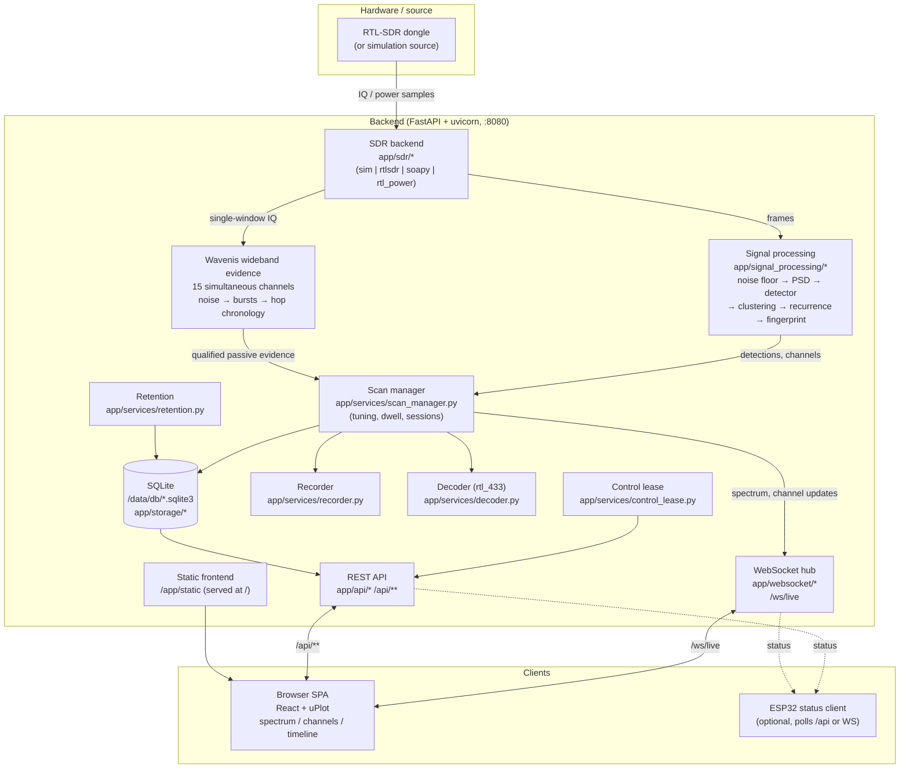

# Architecture

`rtl-sdr-channel-detector` is a **receive-only** RTL-SDR spectrum monitoring app.
It captures a slice of RF spectrum, estimates a noise floor, detects occupied
regions, clusters them into *candidate channels*, and streams the live spectrum
and detections to browser clients over WebSocket. An optional ESP32 acts as a
small status display.

## Component diagram

## Data flow

1. **Capture.** The active **SDR backend** (`app/sdr/`) produces spectrum/power
   frames. `sim.py` generates synthetic data (no hardware); `rtlsdr_backend.py`
   and `rtl_power_backend.py` drive real dongles. Backend is chosen by
   `SDR_BACKEND` via a factory; `SIMULATION_MODE` forces `sim`.
2. **Signal processing** (`app/signal_processing/`):
   - `noise_floor` maintains an EMA noise-floor estimate (`NOISE_FLOOR_ALPHA`).
   - `psd` computes the power spectral density from FFT frames (`FFT_SIZE`).
   - `detector` flags bins that exceed the floor by `DETECTION_THRESHOLD_DB`.
   - `clustering` groups contiguous over-threshold bins, merges nearby regions,
     and clusters recurring regions into **candidate channels**.
   - `recurrence` estimates burst timing / repetition interval.
   - `fingerprint` builds a compact opaque signature (envelope, duration, etc.).
3. **Scan management** (`app/services/scan_manager.py`) sequences tuning across
   `SCAN_START_HZ..SCAN_END_HZ` with `SCAN_STEP_HZ` / `SCAN_DWELL_MS`, owns scan
   **sessions**, and coordinates focus mode. It persists detections, channels,
   events and sessions to **SQLite** (`app/storage/`) and pushes live updates to
   the **WebSocket hub** (`app/websocket/`, `/ws/live`).
4. **Serving.** The **REST API** (`app/api/`) exposes config, channels, events,
   sessions, export, recordings, clients and control endpoints under `/api`.
   The built frontend is served from `/app/static` at `/`.
5. **Clients.** The browser SPA renders the live spectrum (uPlot), a canvas
   waterfall, the candidate-channel table and the event timeline. Exactly one
   client can hold a **control lease** (write config / start-stop); others are
   read-only observers. The optional **ESP32** polls a small status surface.

## Concurrency model

The backend runs an async event loop (uvicorn). The scan loop runs as an async
task feeding the WebSocket hub; the hub fans out throttled `spectrum`
(`SPECTRUM_FPS`, `SPECTRUM_BINS`) and `channels`/`event`/`status` messages to all
connected clients. Writes to SQLite are serialized through the storage layer.

For a parked real RTL-SDR window, `ContinuousIqStream` is the single owner of
device reads and uses the native librtlsdr callback stream from a worker thread.
A bounded queue hands sequence-numbered blocks to DSP; dropped blocks therefore
produce an explicit sample discontinuity instead of silently splicing IQ. Sweep
mode retains bounded synchronous reads because retuning is part of that mode.
Manual and event-triggered recordings copy IQ already held by the rolling buffer
and never issue a second device read while scanning.

## Persistence

SQLite at `DATABASE_PATH` (default `/data/db/channel_detector.sqlite3`) holds
sessions, detections, candidate channels, events and recording metadata. IQ
recordings (when `ENABLE_IQ_RECORDING=true`) are written under `RECORDING_PATH`
with SigMF-style metadata. Retention (`RETENTION_DAYS`, `MAX_IQ_STORAGE_GB`)
prunes old rows and files. Qualified Wavenis observations coalesce into bounded
CU8 captures containing pre/post-trigger IQ and evidence annotations.

See also: [signal-detection.md](signal-detection.md),
[usb-passthrough.md](usb-passthrough.md), [troubleshooting.md](troubleshooting.md).
