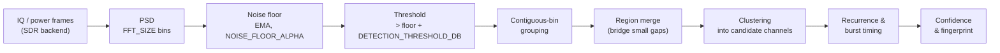

# How signal detection works (and what it does *not* mean)

This document explains the detection pipeline and — just as importantly — the
**limits** of what a detected "channel" represents. The system is **receive-only
and inferential**: it observes energy in the spectrum. It does not demodulate,
authenticate, or interpret protocol semantics.

## Pipeline

1. **Power spectral density (PSD).** Each dwell produces FFT frames of `FFT_SIZE`
   bins. Power per bin is averaged over the dwell to reduce variance.
2. **Noise floor.** A per-bin (or per-band) noise floor is tracked with an
   exponential moving average controlled by `NOISE_FLOOR_ALPHA`. Lower alpha =
   smoother, slower-adapting floor.
3. **Thresholding.** A bin is "occupied" when its power exceeds the local noise
   floor by at least `DETECTION_THRESHOLD_DB`.
4. **Contiguous-bin grouping.** Adjacent occupied bins are grouped into a
   region; the region's center and bandwidth come from its bin extent.
5. **Region merge.** Regions separated by only a small gap (narrow dips inside a
   real emission) are merged so one transmission isn't split into fragments.
6. **Clustering into candidate channels.** Regions that recur at a similar
   center frequency and bandwidth across dwells/scans are clustered into a
   persistent **candidate channel** with a stable `id`.
7. **Recurrence & burst timing.** For each channel the system estimates typical
   burst duration (`typical_burst_ms`) and, if the activity is periodic, a
   `recurrence_interval_s`.
8. **Confidence.** A `0..1` score combines SNR, observation count, stability of
   center/bandwidth, and recurrence consistency. More, cleaner, repeatable
   observations → higher confidence.
9. **Fingerprint.** An opaque signature (center, bandwidth, duration, relative
   strength, repetition interval, and a coarse power **envelope**). It is a
   similarity aid, **not** a decode.

## What a "channel" is — and is not

- A **candidate channel** is an *inferred occupied region* of spectrum where
  energy repeatedly appears. It is derived purely from received power.
- It is **not** an official protocol channel, an assigned frequency, or a
  licensed allocation. The number the UI shows is our internal `id`, not a
  standardized channel number.
- Two distinct devices transmitting on overlapping frequencies may be merged
  into one candidate channel; one frequency-hopping device may appear as many.

### Broad band vs. inferred channels

A **band** (e.g. the 868 MHz ISM band, roughly 863–870 MHz) is a wide regulatory
region in which many unrelated devices operate. Within a band the detector
infers **narrow candidate channels** at the specific center frequencies where it
sees repeated energy. Do not conflate the two:

- "868 MHz" names a **band**, not a signal.
- "candidate channel #7 at 868.300 MHz, ~120 kHz wide" is an **inference** about
  where energy was observed inside that band.

The UI distinguishes the scanned span (the band you configured) from the
inferred channels found inside it.

### Unknown payloads are opaque

The system does **not** demodulate or decode message contents. Optional decoders
(e.g. `rtl_433`) may label some well-known device types, but any payload the
system cannot identify is treated as **opaque**: it is characterized by its RF
footprint (frequency, bandwidth, timing, envelope) only. No attempt is made to
recover, interpret, or reconstruct the underlying data, and none should be
inferred from a detection.

## Sources of error

- **Noise-floor mis-estimation** near strong adjacent signals can hide or
  invent weak detections. Tune `DETECTION_THRESHOLD_DB` / `NOISE_FLOOR_ALPHA`.
- **FFT leakage / windowing** can smear narrow signals across bins, inflating
  apparent bandwidth.
- **Front-end overload / gain** too high causes intermodulation "ghost" signals;
  set `SDR_GAIN` appropriately or use `auto`.
- **Dwell too short** relative to burst timing can miss intermittent emitters.

Treat detections as **evidence of RF activity**, not ground truth about specific
devices or protocols.
